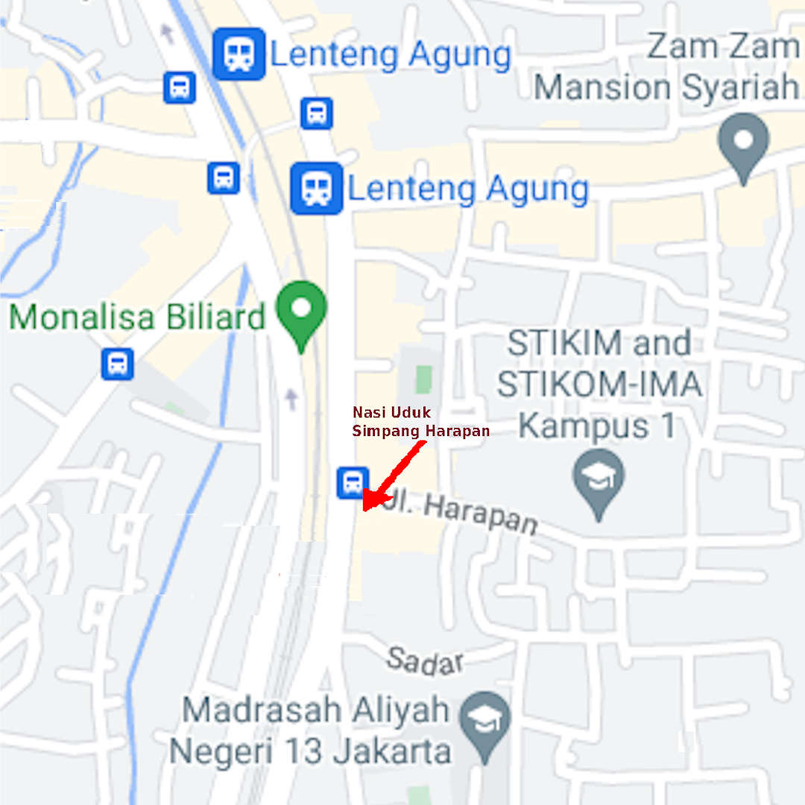
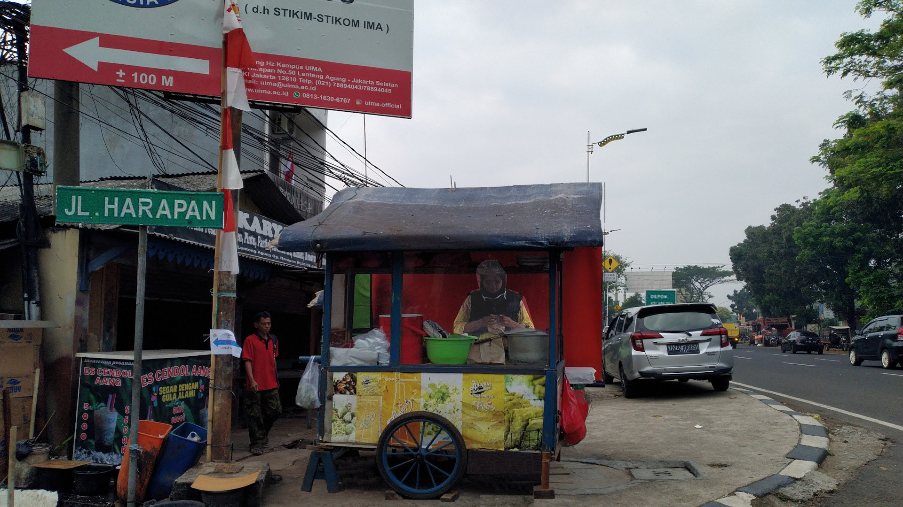
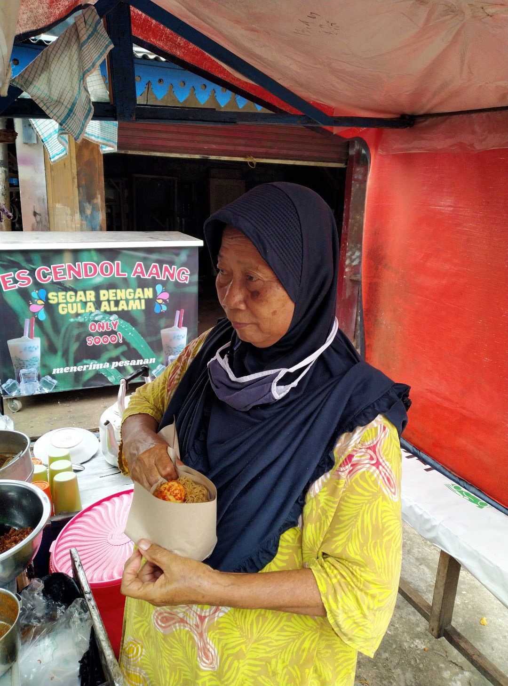
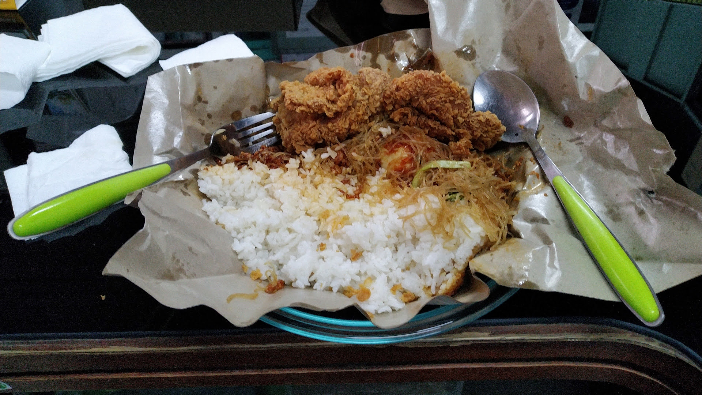

### _config.yml

```
version:          "0003b--23-Aug-2022"
copyright:        "2022-2022"
title:            "Nasi Uduk Ibu Alus"
author:           "Ibu Alus"
address:          "Ujung Simpang Jalan Harapan, LA."
description:
  Nasi Uduk
  Ibu Alus
  Ujung Simpang Jalan Harapan, Lenteng Agung, Jakarta Selatan
disclaimer:
  I have spoken.
tagline:          "Nasi Uduk, Ibu Alus, Simpang Harapan"
keywords:         "jekyll, testing"
navbarlinks:
- navbar:         "Home"
  link:           "/"
- navbar:         "GitHub"
  link:           "https://github.com/sdnbhd/alus"
- navbar:         "Listing"
  link:           "/000.html"
- navbar:         "GitHub Page"
  link:           "https://sdnbhd.github.io/alus/"
lang:             "en-US"
sitemap:          "true"
markdown:         "kramdown"
urlweb:           "https://sdnbhd.github.io/alus/"
urlcontact:       "TBA"
urlgithub:        "https://sdnbhd.github.io/alus/"
google_analytics: "G-R63RWB2DG9"
plugins:
- jekyll-sitemap
- jekyll-seo-tag
- jekyll-paginate
defaults:
- scope:
    path:    ""
  values:
    layout:  "default"
github:
- metadata

```

<br id="idx01">
### index.md

```

---
---

<br id="idx00">
# {{ site.title }}

<br id="idx01">

<br><br>

Setiap pagi, ibu Alus berjualan Nasi Uduk di ujung simpang jalan Harapan,
sekitar 300m setelah stasiun Lenteng Agung -- sebelah kiri jalan arah ke Depok.
Biasanya, ibu Alus bersama pak Alus, yang sudah pensiun dari sebuah BUMN bidang perhubungan.

<br id="idx01">

<br><br>

Gerobak ibu Alus mudah ditemukan karena lokasinya betul-betul di ujung simpang jalan Harapan, Lenteng Agung.
Hanya saja, gerobaknya tanpa tanda / tulisan informasi.

<br id="idx02">

<br><br>

Selain nasi Uduk, ibu Alus juga berjualan Lontong Sayur dan Gorengan.

<br id="idx03">


Untuk tahun 2022 ini, harga Nasi Uduk Telur Standar ialah Rp. 13000.
Kalau dengan "extra tempe", dibulatkan menjadi Rp. 15000.

<br id="idx04">

<br><br>

Syarat dan ketentuan berlaku.
Ayam Goreng dibeli secara terpisah di KFC LA Terrace, sekitar 1300m dari lokasi ibu Alus (arah Depok).

This [GitHub Page](https://pages.github.com/) is hosted at [GitHub.com]({{ site.urlgithub }}).


```

<br id="idx02">
### about.md

```
---
permalink: /ABOUT/
---

# About

This is a GitHub Page template on GitHub.
Fill free to clone/fork/hijack/whatever it!

<br>
# More Information

<ul><li>

  
    <a href="{{ ii.link | relative_url }}">{{ ii.navbar }}</a>
  

</li><li>

  
    <a href="{{ ii.link | relative_url }}">{{ ii.navbar }}</a>
  

</li></ul><br>

# This is the Way!


```

<br id="idx03">
### tips.md

```
---
permalink: /TIPS/
---

# TIPS

4. [Four](https://en.wikipedia.org/wiki/4)<br>
Powder donut cheesecake wafer.
I love sugar plum brownie tart apple pie macaroon.
Donut wafer dragée pudding.

5. [Five](https://en.wikipedia.org/wiki/5)<br>
Soufflé I love gingerbread marshmallow cake I love applicake.
Sugar plum I love jelly beans powder jelly beans.
Ice cream ice cream cupcake liquorice I love.

6. [Six](https://en.wikipedia.org/wiki/6)<br>
Pastry sweet roll applicake bear claw donut sweet roll.
Chocolate carrot cake I love sesame snaps.
Pudding pudding chocolate cake croissant donut pastry pie cupcake cookie.

```

<br id="idx04">
### links.md

```
---
permalink: /LINKS/
---

# LINKS

1. [One](https://en.wikipedia.org/wiki/1)<br>
StarBucks ipsum dolor J.CO Do Not!
McD ipsum dolor Wendy's Burger King.
KFC urna libero, in purus hana masa, tempor hokben lorem.

2. [Two](https://en.wikipedia.org/wiki/2)<br>
Sweet roll lollipop tootsie roll cheesecake marshmallow macaroon chocolate bar biscuit candy.
Donut chocolate cake sugar plum icing dragée pie.
Chocolate marzipan jelly-o soufflé donut pudding apple pie jelly beans.

3. [Three](https://en.wikipedia.org/wiki/3)<br>
Liquorice bonbon lemon drops marshmallow.
Sweet roll gummies gummies jelly tiramisu chocolate fruitcake.
Jelly chocolate jelly beans marzipan brownie bonbon muffin.

```

<br id="idx05">
### Gemfile

```
source "https://rubygems.org/"
gem 'jekyll-sitemap'
gem 'jekyll-seo-tag'
gem 'jekyll-paginate'
gem 'faraday-retry'
gem 'webrick'
gem 'github-pages', group: :jekyll_plugins

```

<br id="idx06">
### _layouts/default.html

```

<!DOCTYPE html>
<html lang="en">
<!-- File _layouts/layout.html           -->
<!-- (c) 2021 - 2022 VauLSMorg           -->
<!-- REV00: Sun 04 Jul 2021 10:00        -->
<!-- START: Wed 17 Feb 2021 19:00        -->
<!-- This is a free HTML file            -->

<body class="plainclass1">
<!-- body class="backclass" -->
<div class="container">
  <header>
  <div class="row">
    <div class="column right2">
      <br>
      {{ page.title | escape }}
      {{ site.title | escape }}
      <br><br>
      {{ page.address | escape }}
      {{ site.address | escape }}
    </div>
  </div>
  </header>
  
  <section>
     {{ content }}
  </section>
  
  
  
</div>
</body>
</html>



```

<br id="idx07">
### Makefile

```
# REV19: Tue 23 Aug 2022 17:00
# REV09: Wed 17 Aug 2022 10:00
# REV07: Tue 03 Aug 2021 09:00
# REV05: Mon 19 Jul 2021 13:00
# REV02: Tue 15 Jun 2021 11:00
# START: Mon 15 Feb 2021 09:00

SITEURL="template.vlsm.org"

ALL: 000.md
	@echo "xyzzy... plugh"

000.md: 000.pmd _config.yml Gemfile _layouts/default.html Makefile index.md about.md tips.md links.md \
        _includes/navbar.html \
        _includes/footer.html _includes/head.html _includes/google-analytics.html \
        images/Nasi-Uduk-Bu-Alus-20220816-0.jpg \
        images/Nasi-Uduk-Bu-Alus-20220816-1.jpg \
        images/Nasi-Uduk-Bu-Alus-20220816-2.jpg \
        images/Nasi-Uduk-Bu-Alus-20220816-3.jpg \
        images/QR.png \
	assets/css/style.css assets/scripts/includeScript.py 
	python assets/scripts/includeScript.py < 000.pmd > 000.md

.siteHack: _site/sitemap.xml
	@bash  .siteHack $(SITEURL)
	@touch .siteHack

.phony: ALL

```

<br id="idx08">
### _includes/head.html

```

<!-- File _includes/head.html             -->       
<!-- (c) 2021 - 2022 VauLSMorg            -->
<!-- REV01: Mon 30 May 2022 03:00:00 WIB  -->
<!-- START: Wed 17 Feb 2021 19:00:00 WIB  -->
<!-- This is a free HTML file             -->
<head>
  <title>
    {{ page.title | escape }} - {{ site.title | escape }}
    {{ site.title | escape }}
  </title>
  <meta charset="utf-8">
  <meta name="viewport"    content="width=device-width, initial-scale=1">
  <meta name="description" content="{{ page.excerpt | default: site.description }}">
  <!-- link href="{{ site.baseurl }}/assets/css/css.css" rel="stylesheet" type="text/css" title="Style" -->
  <!-- link href="/assets/css/css.css" rel="stylesheet" type="text/css" title="Style" -->
  <link href="{{ site.baseurl }}/assets/css/style.css" rel="stylesheet" type="text/css" title="Style">
  
</head>

```

<br id="idx09">
### _includes/navbar.html

```

<!--
File   _includes/navbar.html
REV02: Tue 03 Aug 2021 09:41:00 WIB
REV01: Sun 04 Jul 2021 09:57:16 WIB
START: Wed 17 Feb 2021 19:48:31 WIB
This is a free HTML file
-->

<nav class='navbar'>
  <ul>
        
      <li><a href="{{ ii.link | relative_url }}">{{ ii.navbar }}</a>
    
  </ul>
</nav>


```

<br id="idx10">
### assets/css/style.css

```
/*
 Shamelessly stolen from "Here, There, and Everywhere",
 including but not limited to "bootstrap", "stack overflow", 
 "Mike Dane", "w3schools", et al.
 */

.backclass {
  background-image:url(/assets/images/default.png)
}

.plainclass {
  color:            white;
  background-color: #101030;
}

/* See https://www.w3schools.com/colors/colors_hsl.asp              */
/* See https://www.quackit.com/css/color/charts/hsl_color_chart.cfm */
.plainclass1 {
  color:            hsl(0, 100%, 100%);
  background-color: hsl(0, 10%, 10%);
  line-height:      120%;
  max-width:        70%;
  font-family:      monospace,courier;
}

.plainclass1 li {
  line-height:      140%;
}

.plainclass1 h1 {
  color:            hsl(100, 50%, 50%);
  font-size:        1.9em;
  font-weight:      bold;
}

.plainclass1 h2 {
  color:            hsl(100, 50%, 50%);
  font-size:        1.4em;
  font-weight:      bold;
}

.plainclass1 h3 {
  color:            hsl(100, 50%, 50%);
}

.plainclass1 h4 {
  color:            hsl(100, 50%, 50%);
}

.container {
  max-width:    90%;
  margin:       0 auto;
  font-size:    1em;
  text-align:   justify;
}

.container a {
  color: #a0a0a0;
}

.container a:hover {
  color: #f0f0f0;
}

.row {
}

.column {
  float:            left;
  display:          inline-block;
  background:       #808080;
  height:           130px;
  width:            100%;
  padding-top:      10px;
  padding-bottom:   10px;
  padding-left:     10px;
  padding-right:    10px;
  text-align:       left;
}

.left {
  width:            130px;
}

.right1 {
  height:           100px;
  width:            200px;
  padding-top:      24px;
  padding-bottom:   0px;
  padding-left:     30px;
  font-size:        1.9em;
  font-weight:      bold;
}

.right2 {
  width:            90%;
  padding-top:      5px;
  padding-bottom:   5px;
  padding-left:     30px;
  font-size:        1.3em;
  font-weight:      bold;
}

.youtube {
  float:            left;
  display:          inline-block;
  height:           150px;
  width:            100%;
  padding-top:      10px;
  padding-bottom:   10px;
  padding-left:     10px;
  padding-right:    10px;
}

.yvideo {
  width:            25%;
  height:           100%;
  padding-top:      0px;
  padding-bottom:   0px;
  padding-left:     0px;
  padding-right:    0px;
}

.yinfo {
  width:            calc(75%  - 30px);
  height:           calc(100% - 20px);
  padding-top:      10px;
  padding-bottom:   10px;
  padding-left:     10px;
  padding-right:    10px;
}

.row:after {
  content: "";
  display: table;
  clear: both;
}

.navbar {
  font-size:        0.8em;
  border-width:     0px;
  margin:           0px;
}

.navbar ul li {
  display:          inline-block;
  background-color: hsla(0,     0%,    0%, 1);
  padding:          11px;
}

.navbar ul li a {
  text-decoration:  none;
}

.navbar ul li a:hover {
  background-color: hsla(255,   100%,   50%, 1);
  font-size:        1.15em;
  font-weight:      bold;
  padding:          2px;
}

pre {
  background-color: hsla(0,     0%,    0%, 1);
  border:           1px solid hsla(0,    50%,   20%, 1);
  padding:          10px;
  font-size:        16px;
  color:            hsla(0,   100%,  100%, 1);
  border-radius:    2px;
  word-wrap:        normal;
  overflow:         auto;
  overflow-y:       hidden;
}

table {
  width: 100%;
  margin: 0 0 20px 0;
}

th {
  text-align: left;
  border-bottom: 1px dashed #b5e853;
  padding: 5px 10px;
}

td {
  padding: 5px 10px;
}

/*
  ZCZC
  border: 1px solid rgba(255, 255, 255, 0.15);
  padding: 10px; 
  color: #b5e853;
  background: rgba(0, 0, 0, 0.9);
  border-radius: 2px;
  word-wrap: normal;
  overflow: auto;
  overflow-y: hidden;
  max-width: 65%;

 */

/*
 ************************************************************
 */

@media screen and (max-width:768px) {
  ul {
    margin: 0;
    padding: 0;
  }
  #navbar ul li {
    display: block;
    width: 100%;
    padding: 0;
    margin: 0;
    text-align: center;
  }
  #navbar ul li a {
    margin: 0;
    padding: 0;
  }
  #menu {
    display: none;
  }
  #maincontent {
    width: 100%;
    padding: 0;
  }
  h1 {
    font-size: 1em;
  }
}

/*
 ************************************************************
 */


```

<br id="idx11">
### _includes/google-analytics.html

```

<!--
File:  _includes/google-analytics.html

REV02: Tue 03 Aug 2021 09:34:59 WIB
REV01: Wed 31 Mar 2021 07:15:14 WIB
START: Wed 17 Feb 2021 19:47:55 WIB

Google Analytics: Global site tag (gtag.js) 
-->


  <script
    async src="https://www.googletagmanager.com/gtag/js?id={{ site.google_analytics }}">
  </script>
  <script>
    window.dataLayer = window.dataLayer || [];
    function gtag(){dataLayer.push(arguments);}
    gtag('js', new Date());
    gtag('config', '{{ site.google_analytics }}');
  </script>



```

<br id="idx12">
### assets/scripts/includeScript.py 

```
# (c) 2011 Brice Fernandes. This script was ripped from 
# https://fractallambda.com/2011/08/17/pincpy-including-files-and-script-output.html
# Note: This script is outdated.  
# The author uses Handlebars.js or Pystache for the same purpose.
# Usage: 
#     python .program/xx.py < in.pmd > out.md

import sys
import re
import shlex
import subprocess as sp
 
exe_pat = re.compile(r'(\s*)\(!>(.*)<\)\s*')
inc_pat = re.compile(r'(\s*)\(>(.*)<\)\s*')
 
if __name__ == "__main__":
  for line in sys.stdin:
    match_exe = re.match(exe_pat, line)
    match_inc = re.match(inc_pat, line)

    if match_exe:
      space = match_exe.group(1)
      exe = match_exe.group(2).strip()
      args = shlex.split(exe)
      sys.stdout.writelines(
        map(
          lambda x: space+x+"\n", 
          sp.check_output(args).split("\n")))

    elif match_inc:
      space = match_inc.group(1)
      inc = match_inc.group(2).strip()
      sys.stdout.writelines(
        map(
          lambda x: space+x, 
          open(inc)))

    else:
      sys.stdout.write(line)

```

