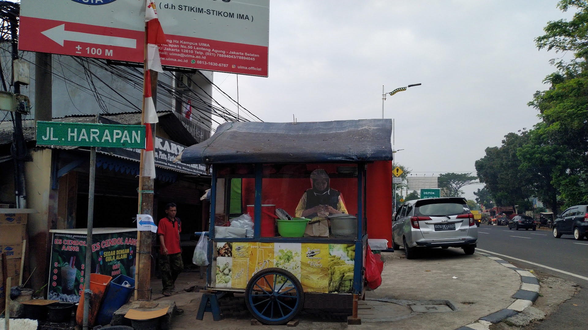
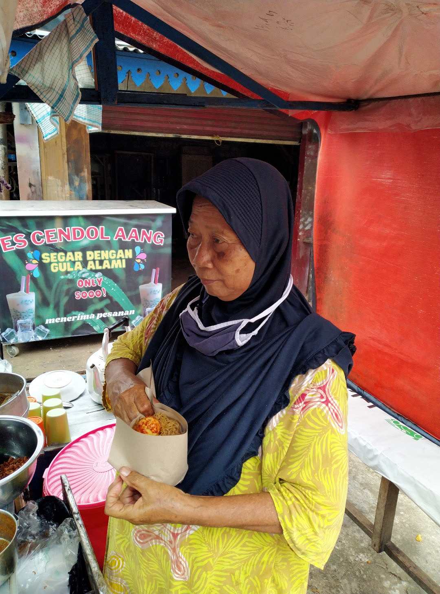

---
---

 
# {{ site.title }}

 

  

Setiap pagi, ibu Alus berjualan Nasi Uduk di ujung simpang jalan Harapan,
sekitar 300m setelah stasiun Lenteng Agung -- sebelah kiri -- jika mengarah ke Depok.
Biasanya, ibu Alus bersama pak Alus, yang sudah pensiun dari sebuah BUMN bidang perhubungan.

 

  

Gerobak ibu Alus mudah ditemukan karena lokasinya betul-betul di ujung simpang jalan Harapan, Lenteng Agung.
Hanya saja, gerobaknya tanpa tanda / tulisan informasi.

 

  

Selain nasi Uduk, ibu Alus juga berjualan Lontong Sayur dan Gorengan.

 

Untuk tahun 2022 ini, harga Nasi Uduk Telur Standar ialah Rp. 13000.
Kalau dengan "extra tempe", dibulatkan menjadi Rp. 15000.

 

  

Syarat dan ketentuan berlaku.
Ayam Goreng dibeli secara terpisah di KFC LA Terrace, sekitar 1300m dari lokasi ibu Alus (arah Depok).

This [GitHub Page](https://pages.github.com/) is hosted at [GitHub.com]({{ site.urlgithub }}).

